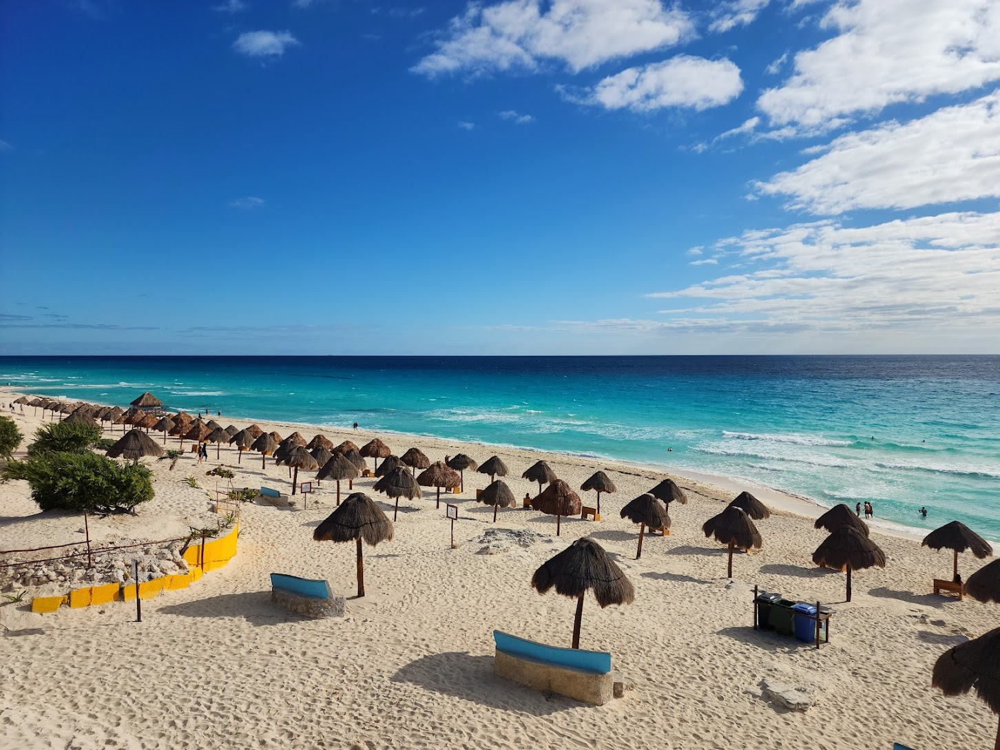
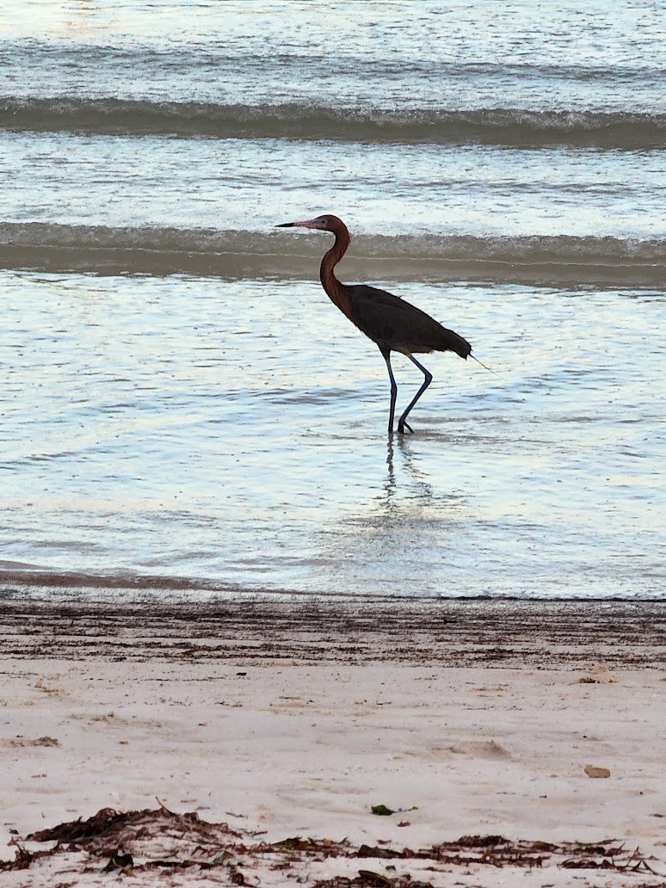
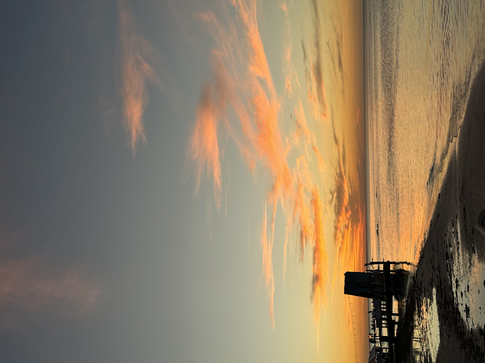
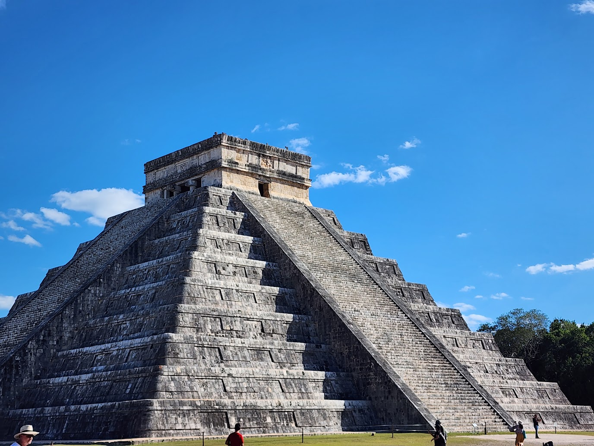
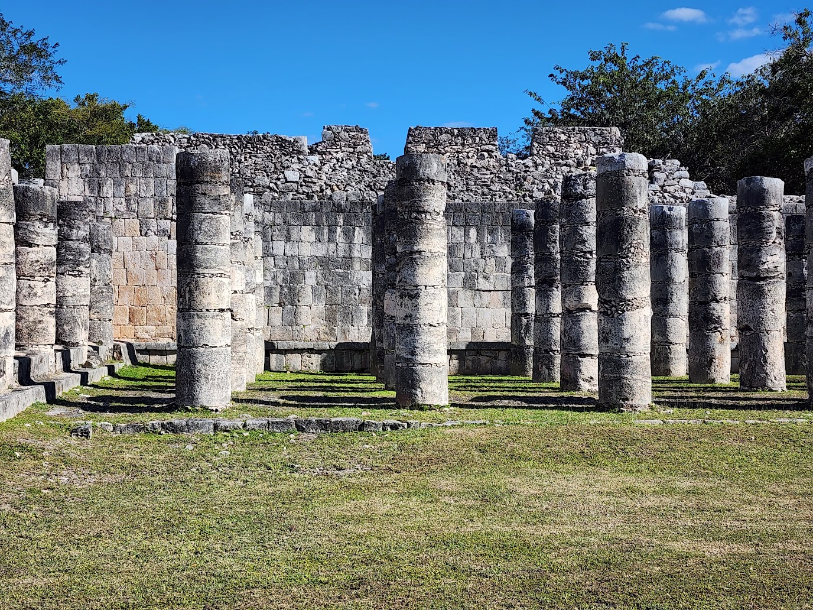
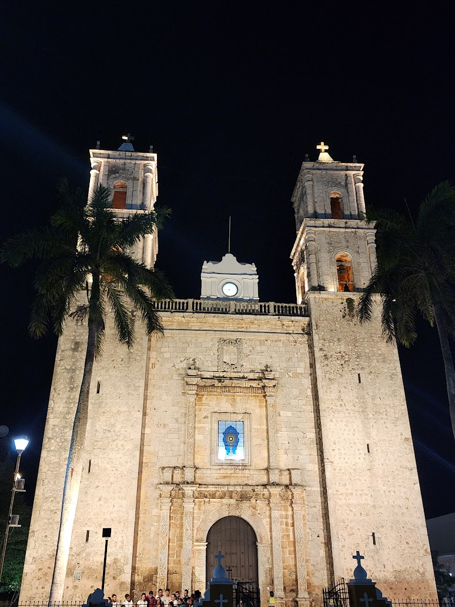
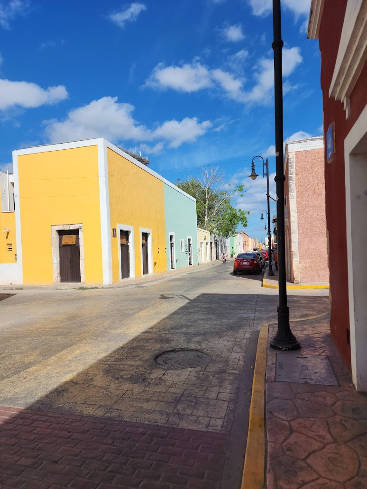
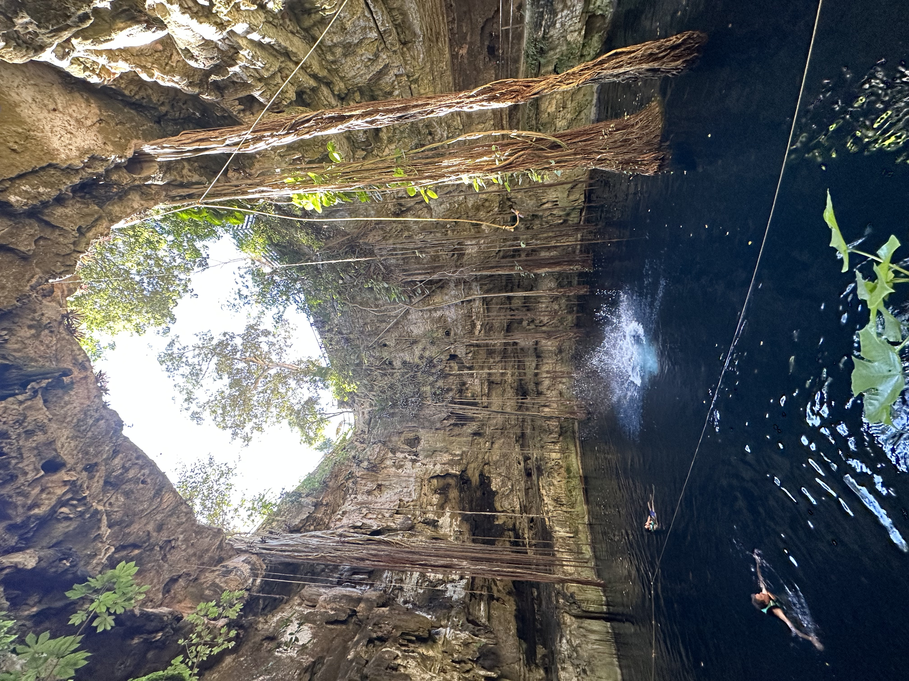
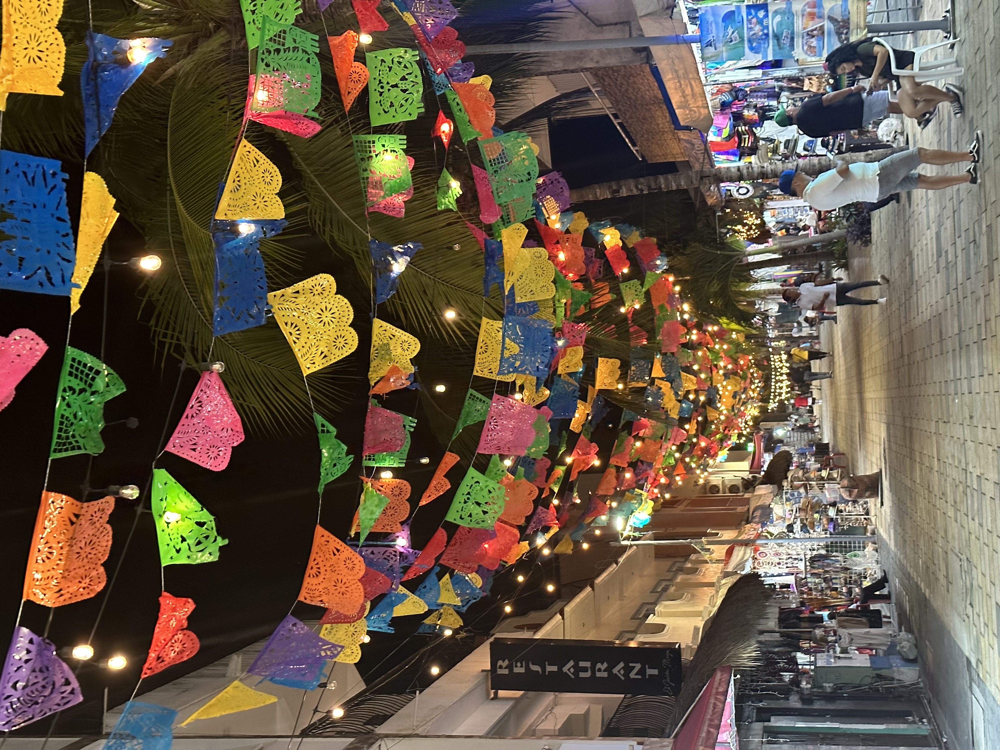

I just returned from a joyful, thrilling and intesive trip to Yucatan Peninsula in Mexico. The Yucatan peninsula in Mexico is a paradise, with its pristine beaches, ancient Mayan ruins, and vibrant culture. We visited a variety of destinations including Cancun, Holbox Island, Chichen Itza, Valladolid, Tulum, Cozumel, and Playa Del Carmen. A few people reached out to me for the itinerary so I thought I'll write it up here.

**15/1**

The journey began in Cancun, the famous resort town known for its white sandy beaches and crystal-clear waters. This was the first day of the trip and we didn't do much in Cancun - visited the hotel zone which is known for nightlife and visited the very blue and white beaches of Cancun. 

*The very blue beaches of Cancun, with its many palapas.*

**16/1**

We proceeded to Chiquila, the mainland town from where we had to take a ferry to Holbox island. This tranquil island is a haven for birdwatchers and nature lovers, with its mangrove swamps and lagoons teeming with wildlife. It is also one of the few places with bioluminescence in the sea, though it is best visible from June to September, the hottest months at Holbox. Note that cars are not allowed in this island. You have to park your car in Chiquila, which costs around 100 pesos (~ USD $6) for 24 hours. Chiquila is a very small town with nothing much to do except park your car.

*The Holbox island with its very many birds and calm beaches. This is a reddish egret, wading through the waters*

*The sunset at Holbox is breathtaking*

**17/1**

Next, we headed to the ancient Mayan city of Chichen Itza, one of the most impressive archaeological sites in Mexico. This place is best known for the Temple of Kukulcán, the pyramid built by the Mayans. There are some other ruins as well, including multiple _mandapam_ like structres, jaguar sculptures and a 1000 pillar column. There are many things to look at and spread across a huge area so carry water when you go here.

*The pyramid at Chichen Itza, built around 8th-12th century AD*

*The thousand pillar column at Chichen Itza, not very different from the one in Sri Rangam*

We stayed at Valladolid for the day. It is a charming colonial town known for its well-preserved Spanish architecture. In the few hours we were there, we say a dance performance, a street concert, a light show and a Mayan fire dance - all this on a random Tuesday. It is a really fun and calm town, a place to go for silent stay. Valladolid was just a pitstop for us, but it turned into this super cool place we fell in love with.

*The Templo de San Servacio, built by the Spanish in 1545*

*A very colonial city, with cobbled streets and European street lamps*

**18/1**

We took a dip in the Cenote San Lorenzo Oxman, a cenote, fifty meter deep. It was safe with sturdy life jackets. You could just move around in the cenote for half a day, it is so calming.

*The Oxman Cenote*

Tulum was our next destination, a picturesque coastal town known for its ancient Mayan ruins and bohemian vibe. The Mayan ruins are set on a cliff overlooking the turquoise waters of the Caribbean sea. Tulum is better when you stay at a resort and chill. 

**19/1**

Cozumel, an island off the eastern coast of the Yucatan peninsula, was our next destination, known for its world-class diving and snorkeling. We went snorkeling at Cozumel and walked the vibrant streets. The nights stay was at Playa Del Carmen, the mainlaind city off Cozumel. Let me tell you about Playa Del Carmen. It a bustling, well lit town known for its nightlife, shopping and dining. How it could manage to have nightlife and still be a calm and peaceful town I'll never know. This was the last day of the trip.

*Snorkeling at Cozumel*

*The very well lit city of Playa Del Carmen. This is not a one-off street, every place in PDC is lit*

Now some details for people looking to visit Yucatan peninsula from the US -

1. Mexico lets you stay in the country for six months if you have a valid US visa. While it is better to verify once for your visa type, I know people who've visited in the student F1 visa as well. 
2. You can hire a car near Cancun airport. All the American car rentals are available in Cancun. I would recommend Enterprise, the staff was really helpful. They pickup and drop you in the airport as well, from the rental place.
3. Before the trip, have some dollar bills so you can convert it to Mexican pesos. You can check the exchange rate before leaving.
4. You can bargain and reduce prices in most places - whether it is snorkeling or buying some souvenir. It's better to have someone with you who can bargain.
5. The places we visited were very safe. We did not feel scared in any of the places, contrary to popular view of Mexico - but it is better to check reviews of a place/beach before visiting.